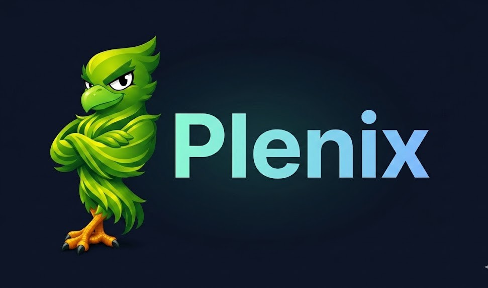

# Olá, prazer em conhecê-lo(a)! eu me chamo Giovane Carapecov.

Sou um desenvolvedor em constante evolução, focado em transformar problemas reais em produtos eficientes, unindo engenharia de software com impacto social.

## 🚀 Projeto Principal
**Plenix 🐦‍🔥** - Uma plataforma web (PHP) focada na ODS-8 para impulsionar pequenos comerciantes através de diagnósticos inteligentes.

*   **Diagnóstico Inteligente:** Análise de saúde do negócio para empreendedores que precisam de uma bússola.
*   **Foco no Usuário:** Interface pensada para quem não tem tempo a perder e precisa de clareza.
*   **Engenharia de Produto:** Desenvolvido com foco em escalabilidade e manutenção.

  

## 🛠️ Tecnologias e Ferramentas

*PHP Web Developer*

---

*Game Developer*

## 📊 Minhas Estatísticas

  

---

## 📫 Vamos nos conectar?

